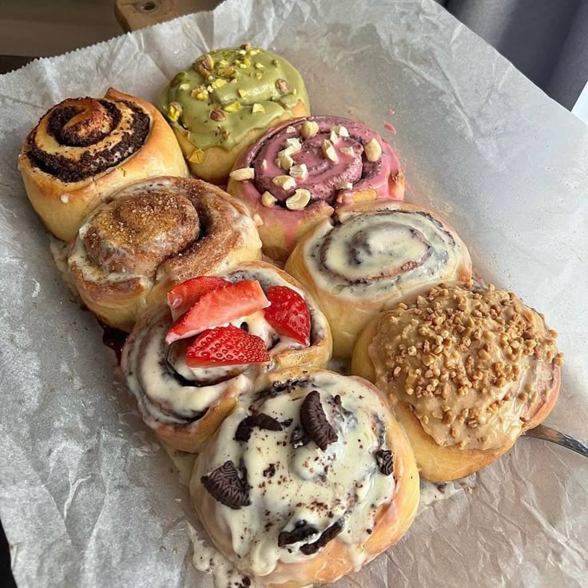
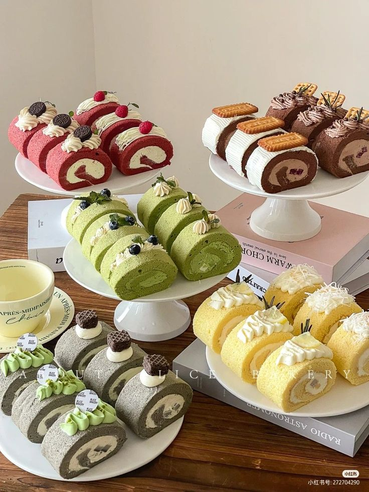
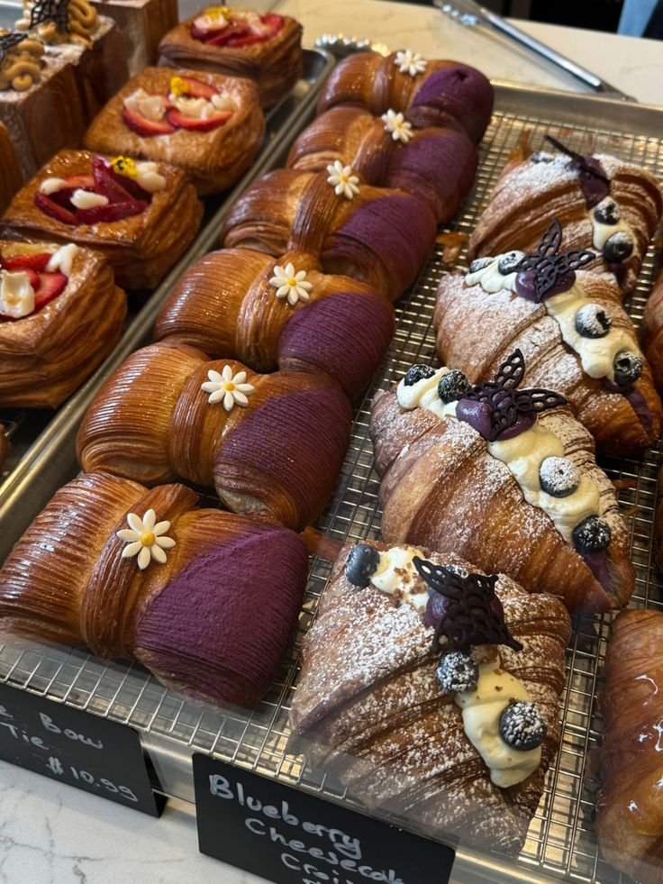
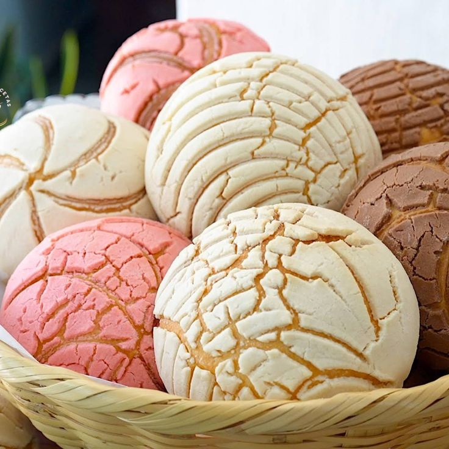
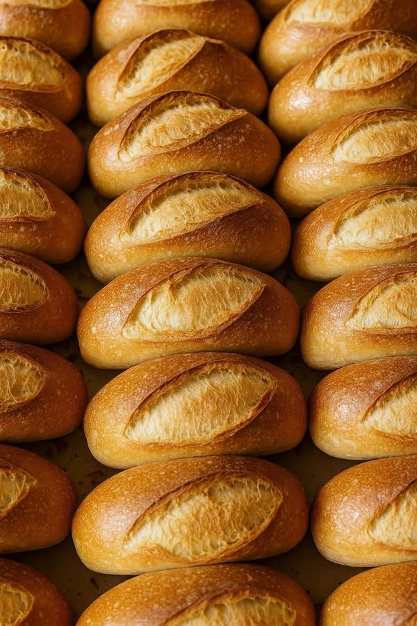

<!DOCTYPE html>
<html lang="es">
<head>
<meta charset="UTF-8">
<meta name="viewport" content="width=device-width, initial-scale=1.0">
<title> BL STORM-SHOP </title>

<link href="https://fonts.googleapis.com/css2?family=Poppins:wght@300;500;700&display=swap" rel="stylesheet">

</head>

<body>

<header>

<h1> BL STORM-SHOP</h1>

 "Diseños únicos para fans que viven cada hitoria con intensidad"

</header>

<nav>
<a onclick="mostrar('inicio')">Inicio</a>
<a onclick="mostrar('menu')">Menú</a>
<a onclick="mostrar('resenas')">Reseñas</a>
<a onclick="mostrar('pago')">Pago</a>
</nav>

<!-- INICIO -->
<section id="inicio" class="seccion activa">
<h2>Bienvenido a Panaderia Luna </h2>

 Prueba nuestros dulces y deliciosos postres.

<!-- ESPACIO PARA VIDEO -->

<video width="100%" controls>
<source src="muñe.mp4" type="video/mp4">
Tu navegador no soporta el video.
</video>

</section>

<!-- MENÚ -->
<section id="menu" class="seccion">

<h2> postres de luna </h2>

 Dulces y salados para cada antojo 

<h3>Mini Tartas </h3>
$25MX

<h3>Entremet Chocolat Praline Noisette</h3>
$650MX

<h3> Éclair de Fresa </h3>
$65MX

<h3>Profiteroles clasicos </h3>
$25MX

<h3>Roles Glaciados</h3>
$45MX

<h3>Caja de 10 Galletas </h3>
$75MX

<h3>Brazo Gitano</h3>
$35MX

<h3>Croissant Rellenos</h3>
$40MX

<h3>Conchas</h3>
$10MX

<h3>Bolillos</h3>
$5MX

<h3>Panecillos de Queso philadelphia</h3>
$8MX

<h3>Palillos de Pan</h3>
$35MX

<h3>Pan con Ajo </h3>
$65MX

<h3>Baguette de Mozzarella</h3>
$55MX

<h3>Brioche Hot Dog Buns</h3>
$10MX

</section>

<!-- RESEÑAS -->
<section id="resenas" class="seccion">
<h2>⭐ Reseñas</h2>

"Excelente calidad y muy buena presentación."
★★★★★

"Muy buen sabor y excelente atención."
★★★★★

"Los profiteroles son muy ricos."
★★★★☆

"Precios muy  accesibles y buena calidad."
★★★★★

</section>

<!-- PAGO -->
<section id="pago" class="seccion">
<h2>💳 Pago con tarjeta</h2>

<form class="form-pago">
<input type="text" placeholder="Nombre en la tarjeta">
<input type="text" placeholder="Número de tarjeta">
<input type="text" placeholder="MM/AA">
<input type="text" placeholder="CVV">
<button type="submit">Pagar ahora</button>
</form>

</section>

<footer>
© 2026 panaderia Luna | Todos los derechos reservados
</footer>

</body>
</html>
